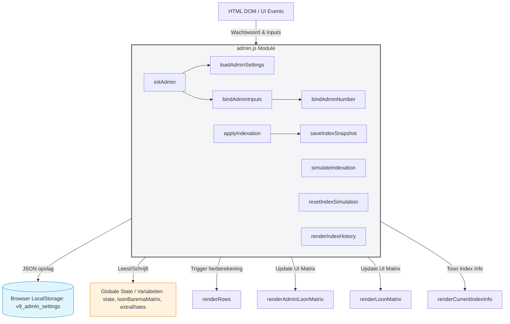

# V10 fixed versie

### 📊 Module Verbindingen (admin.js)

Dit diagram toont hoe `admin.js` via UI-events communiceert met lokale opslag en externe functies binnen de frontend:

### 🔍 Belangrijke Afhankelijkheden (Dependencies)

Om te voorkomen dat deze module crasht, leunt `admin.js` op de aanwezigheid van de volgende **globale objecten en functies** elders in de code:

1. **Globale State & Data:**
   * `state`: Wordt gebruikt om simulatie-statussen (`indexSimulationActive`) bij te houden.
   * `loonBaremaMatrix` & `extraRates`: De loongegevens die door de indexatiefunctie worden overschreven.

2. **Externe Render Functies (Losgekoppeld via `typeof` checks):**
   * `renderRows()`: Wordt aangeroepen na wijzigingen om de hoofdtabellen te herberekenen.
   * `renderLoonMatrix()` & `renderAdminLoonMatrix()`: Updaten de visuele tabellen na een indexatie of simulatie.
   * `renderCurrentIndexInfo()`: Updatet de labels met de huidige indexatiedatum.

3. **Helper Functies:**
   * `parseNum()`: Nodig om komma-getallen uit de UI om te zetten naar JavaScript floats.
   * `nfmt()`: Nodig in de geschiedenistabel om de indexeringsfactor mooi af te ronden (4 decimalen).

Aangepast:
-indexatie van de loonmatrix toegepast
-historie van deze indexaties
config.js
│
├─ loonBaremaMatrix (basis)
├─ dagCodeRules
├─ DEFAULT_ADMIN_SETTINGS
└─ SMART_HOURS_DEFAULTS

state.js
│
├─ entries
├─ loonMatrix (actieve versie)
├─ indexSimulationActive
└─ indexFactor

storage.js
│
├─ save()
├─ load()
└─ saveAdminSettings()

admin.js
│
├─ indexatie
├─ premies
├─ smart hours
└─ historiek

engine.js
│
├─ calculateDay()
├─ ploegpremies
├─ ancienniteit
└─ dagtotalen

plugins.js
│
├─ basisloon
├─ FF
├─ context shift
└─ extra premies

ui.js
│
├─ renderRows()
├─ renderTotals()
├─ renderLoonMatrix()
└─ renderAdminLoonMatrix()
__ renderIndexatie

app.js
│
├─ init()
├─ tabs
├─ resizer
└─ event orchestration
