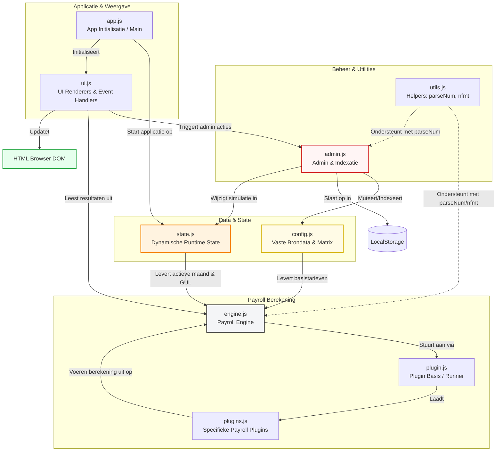
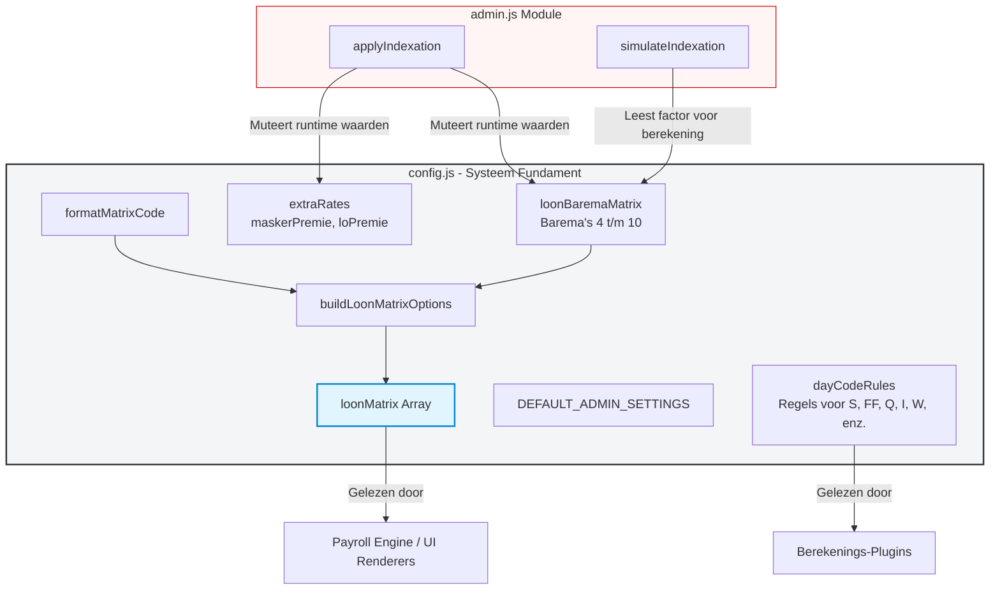
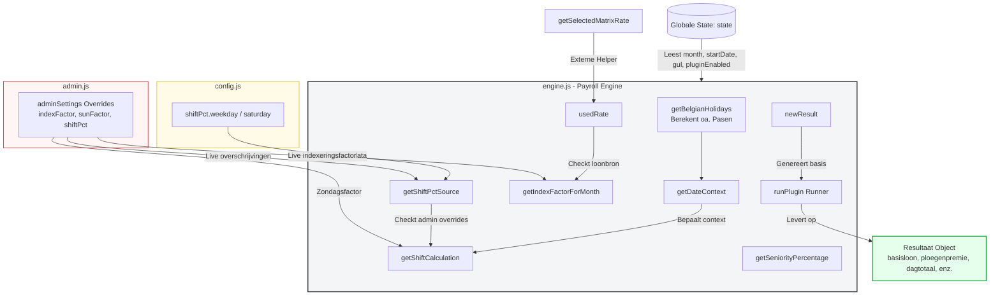
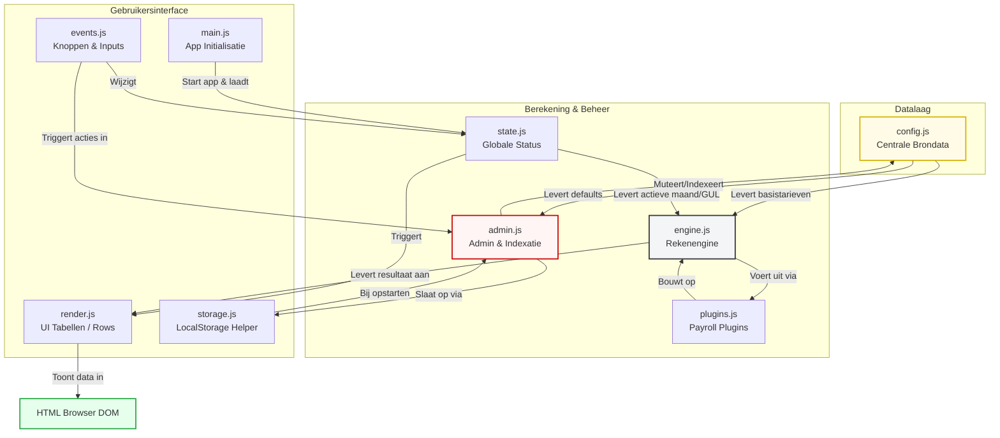

# V10 fixed versie

### 🏗️ Applicatie Architectuur (Alle 9 JavaScript Modules)

Dit diagram toont hoe de 9 modules binnen je frontend-applicatie met elkaar verbonden zijn en hoe data door het systeem stroomt:

### 💡 Waarom dit diagram jouw documentatie krachtig maakt:
* **Groepering per verantwoordelijkheid:** Door de modules op te delen in *Data*, *Rekenkern*, *Helpers* en *UI*, ziet een lezer direct waar een bepaald stuk code thuishoort.
* **Zichtbare datastromen:** Je ziet precies hoe `utils.js` (met functies zoals `parseNum`) zowel de rekenengine als het adminpaneel ondersteunt.
* **Geen terminalcommando's nodig:** Je hoeft dit nooit lokaal te compileren. GitHub tekent dit live op basis van deze tekst.

Als je de documentatie nog verder wilt verrijken, kan ik voor de nieuwe modules (zoals **`state.js`** of **`utils.js`**) een korte beschrijving maken van welke functies erin horen te zitten. Wil je dat we de documentatie voor een specifieke module nog verder uitdiepen?

### 📊 Module Verbindingen (config.js)

Dit diagram toont hoe de data uit `config.js` als basis dient voor de applicatie, en hoe `admin.js` hierop inbrengt tijdens runtime:

### 🔍 Architectuur & Dataflow Analyse

Bij het documenteren van deze module zijn er drie belangrijke aspecten om te onthouden voor toekomstig onderhoud:

1. **Gedrag van de data (Muteerbaarheid):**
   * Hoewel de file start met `const`, zijn `loonBaremaMatrix` en `extraRates` objecten. In JavaScript betekent dit dat hun *inhoud* nog steeds aangepast kan worden. 
   * `admin.js` maakt hier actief gebruik van tijdens de **indexatie** (`applyIndexation`) om de uurlonen live te verhogen.

2. **De `loonMatrix` Backwards Compatibility Bridge:**
   * De functie `buildLoonMatrixOptions()` transformeert de overzichtelijke `loonBaremaMatrix` (een object) naar een platte array `loonMatrix` (bijv. `{ code: "S04", rate: 19.9596 }`).
   * **Belangrijk:** Deze transformatie gebeurt *éénmalig* bij het opstarten van de app. Als de admin daarna de loonmatrix indexeert, verandert de oude `loonMatrix`-array **niet automatisch** mee, tenzij de UI de functie `buildLoonMatrixOptions()` opnieuw triggert.

3. **Gekoppelde Plugins via `dayCodeRules`:**
   * De `calculation`-property in `dayCodeRules` (zoals `ff`, `basicWage`, `contextShift`) mapt direct naar de strings in `pluginMeta`. Dit stuurt de rekenengine van de app aan.

---

Als je wilt, kunnen we nu kijken naar de **Payroll Engine / Render module** (de module die `renderRows()` of de berekeningen uitvoert). Dat is de ontbrekende schakel die de cirkel tussen `config.js` en `admin.js` compleet maakt. Wil je die code hier delen?

### 📊 Module Verbindingen (engine.js)

Dit diagram visualiseert hoe `engine.js` als centrale verwerker fungeert. Het trekt data aan uit zowel `config.js` als `admin.js`, berekent de payroll en spuugt een resultaatobject uit:

### 🔍 Belangrijke Rekenlogica & Relaties

Wanneer je aanpassingen doet in de berekeningen, let dan goed op de volgende drie architectonische verbindingen:

1. **De Indexatie-Uitzondering (`usedRate`):**
   * Als een dagcoderegel de loonbron `matrix` heeft, wordt het basistarief vermenigvuldigd met de `indexFactor` uit `admin.js`.
   * Als de loonbron `gul` (Garantie Uur Loon) is, wordt de indexeringsfactor **bewust genegeerd** en valt de engine direct terug op `state.gul`.

2. **Dynamische Shift Toeslagen (`getShiftPctSource`):**
   * De engine kijkt altijd eerst of de beheerder in de UI de percentages heeft aangepast (`adminSettings.saturdayShiftPct` of `weekdayShiftPct`). Pas als die er *niet* zijn, valt de engine terug op de hardgecodeerde fabrieksinstellingen (`shiftPct`) uit `config.js`.

3. **Zondags- en Feestdagen-Multiplier:**
   * In `getShiftCalculation` worden het basisloon en de ploegenpremie automatisch vermenigvuldigd (standaard `×2.00`) zodra de datumcontext een zondag of feestdag is. Dit getal wordt dynamisch uit `adminSettings.sunFactor` getrokken.

4. **Plugin Structuur (`runPlugin`):**
   * De engine voert berekeningen modulair uit. Via `state.pluginEnabled` wordt per dag/code gecontroleerd welke plugin (zoals gedefinieerd in `pluginMeta` in de config) mag draaien om het `newResult`-object te vullen.

### 🏗️ Applicatie Architectuur (9 Modules)

Dit diagram toont de interactie en dataflow tussen alle 9 JavaScript-modules binnen het project:

Aangepast:
-indexatie van de loonmatrix toegepast
-historie van deze indexaties
config.js
│
├─ loonBaremaMatrix (basis)
├─ dagCodeRules
├─ DEFAULT_ADMIN_SETTINGS
└─ SMART_HOURS_DEFAULTS

state.js
│
├─ entries
├─ loonMatrix (actieve versie)
├─ indexSimulationActive
└─ indexFactor

storage.js
│
├─ save()
├─ load()
└─ saveAdminSettings()

admin.js
│
├─ indexatie
├─ premies
├─ smart hours
└─ historiek

engine.js
│
├─ calculateDay()
├─ ploegpremies
├─ ancienniteit
└─ dagtotalen

plugins.js
│
├─ basisloon
├─ FF
├─ context shift
└─ extra premies

ui.js
│
├─ renderRows()
├─ renderTotals()
├─ renderLoonMatrix()
└─ renderAdminLoonMatrix()
__ renderIndexatie

app.js
│
├─ init()
├─ tabs
├─ resizer
└─ event orchestration
