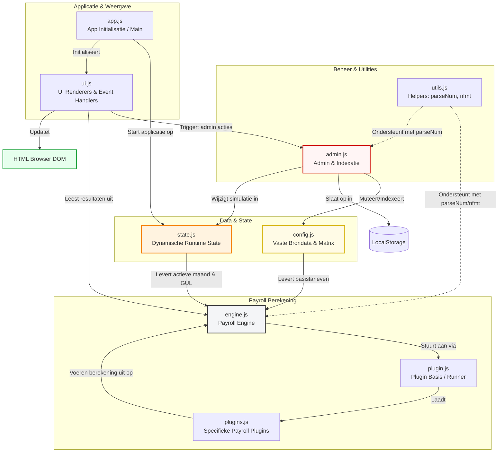

# V10 fixed versie

### 🏗️ Applicatie Architectuur (Alle 9 JavaScript Modules)

Dit diagram toont hoe de 9 modules binnen je frontend-applicatie met elkaar verbonden zijn en hoe data door het systeem stroomt:

### 💡 Waarom dit diagram jouw documentatie krachtig maakt:
* **Groepering per verantwoordelijkheid:** Door de modules op te delen in *Data*, *Rekenkern*, *Helpers* en *UI*, ziet een lezer direct waar een bepaald stuk code thuishoort.
* **Zichtbare datastromen:** Je ziet precies hoe `utils.js` (met functies zoals `parseNum`) zowel de rekenengine als het adminpaneel ondersteunt.
* **Geen terminalcommando's nodig:** Je hoeft dit nooit lokaal te compileren. GitHub tekent dit live op basis van deze tekst.

Als je de documentatie nog verder wilt verrijken, kan ik voor de nieuwe modules (zoals **`state.js`** of **`utils.js`**) een korte beschrijving maken van welke functies erin horen te zitten. Wil je dat we de documentatie voor een specifieke module nog verder uitdiepen?

Aangepast:
-indexatie van de loonmatrix toegepast
-historie van deze indexaties
config.js
│
├─ loonBaremaMatrix (basis)
├─ dagCodeRules
├─ DEFAULT_ADMIN_SETTINGS
└─ SMART_HOURS_DEFAULTS

state.js
│
├─ entries
├─ loonMatrix (actieve versie)
├─ indexSimulationActive
└─ indexFactor

storage.js
│
├─ save()
├─ load()
└─ saveAdminSettings()

admin.js
│
├─ indexatie
├─ premies
├─ smart hours
└─ historiek

engine.js
│
├─ calculateDay()
├─ ploegpremies
├─ ancienniteit
└─ dagtotalen

plugins.js
│
├─ basisloon
├─ FF
├─ context shift
└─ extra premies

ui.js
│
├─ renderRows()
├─ renderTotals()
├─ renderLoonMatrix()
└─ renderAdminLoonMatrix()
__ renderIndexatie

app.js
│
├─ init()
├─ tabs
├─ resizer
└─ event orchestration
