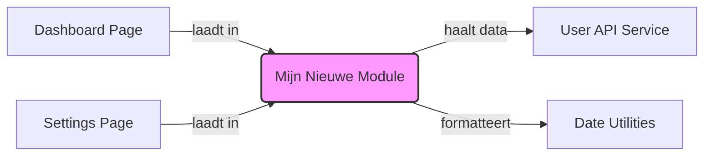

# V10 fixed versie

### 📊 Module Verbindingen

Hieronder zie je hoe deze frontend-module verbonden is met de rest van de applicatie:

Aangepast:
-indexatie van de loonmatrix toegepast
-historie van deze indexaties
config.js
│
├─ loonBaremaMatrix (basis)
├─ dagCodeRules
├─ DEFAULT_ADMIN_SETTINGS
└─ SMART_HOURS_DEFAULTS

state.js
│
├─ entries
├─ loonMatrix (actieve versie)
├─ indexSimulationActive
└─ indexFactor

storage.js
│
├─ save()
├─ load()
└─ saveAdminSettings()

admin.js
│
├─ indexatie
├─ premies
├─ smart hours
└─ historiek

engine.js
│
├─ calculateDay()
├─ ploegpremies
├─ ancienniteit
└─ dagtotalen

plugins.js
│
├─ basisloon
├─ FF
├─ context shift
└─ extra premies

ui.js
│
├─ renderRows()
├─ renderTotals()
├─ renderLoonMatrix()
└─ renderAdminLoonMatrix()
__ renderIndexatie

app.js
│
├─ init()
├─ tabs
├─ resizer
└─ event orchestration
